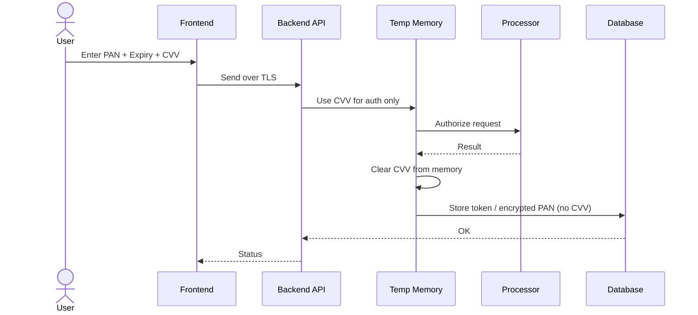
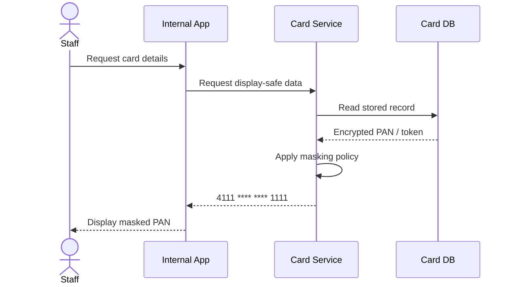
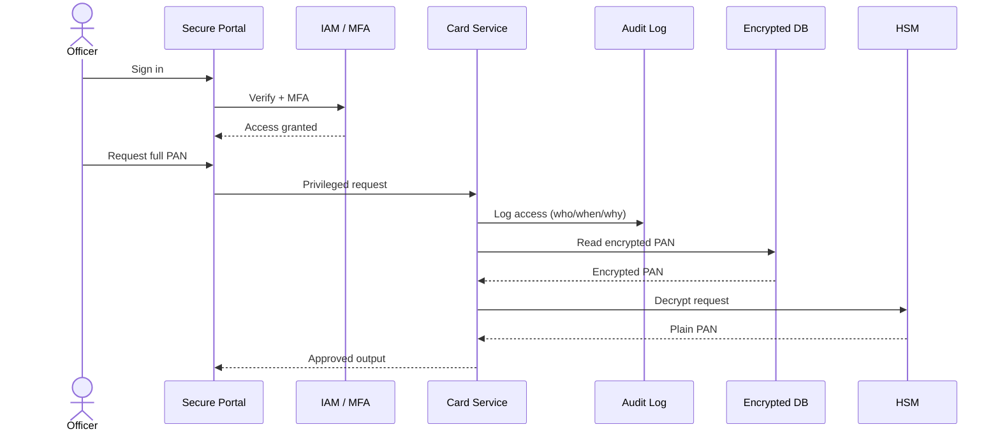

# 🔐 PCI DSS Security Controls

## Core Principles

### Data Minimization
- Store only required data

### Encryption
- AES-256 (storage)
- TLS 1.2+ (transport)

### Tokenization
- Replace PAN with token

### Key Management
- Use HSM / KMS
- Rotate keys

---

## 🔄 Security Flow Diagrams

### 1. CVV Handling (Must Not Be Stored)

### 2. Masked Card Display (Least Privilege)

### 3. Privileged Access + Audit Logging

---

## Controls by Layer

### Frontend
- No logging card data
- HTTPS only

### Backend
- RBAC + MFA
- No sensitive logs

### Database
- Encrypted PAN
- Audit logs

### Network
- Segmented CDE
- Firewall rules

---

## CVV Rule
- NEVER store CVV
